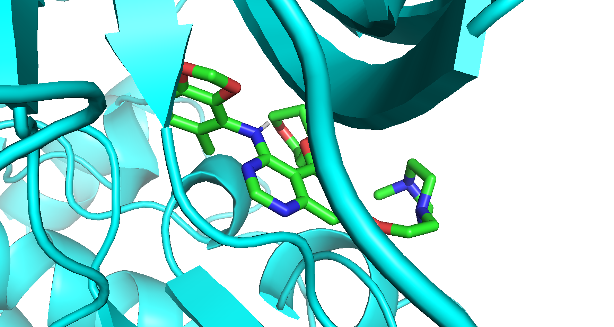

# [AutoDock Vina](https://github.com/ccsb-scripps/AutoDock-Vina)

## システム環境
- Mac（Apple M1, Ventura 13.1）

## Installation
### AutoDock Vina
[公式リポジトリ](https://github.com/ccsb-scripps/AutoDock-Vina/releases/)から `vina_1.2.5_mac_x86_64`をダウンロードし、適当なディレクトリ (ここでは `~/opt/`)にインストール:

```bash
mkdir -p ~/opt
mv vina_1.2.5_mac_x86_64 ~/opt/
export PATH="$PATH:~/opt/"
cd ~/opt/
ln -s vina_1.2.5_mac_x86_64 vina
```

### MGLToolsまたはADFRsuite
本プロトコールではADFRsuiteを使用する

#### MGLTools
[公式サイト](https://ccsb.scripps.edu/mgltools/downloads/)から `mgltools_1.5.7_MacOS-X.tar_.gz` をダウンロードしてインストール:

```bash
mkdir -p ~/opt
mv mgltools_1.5.7_MacOS-X.tar_.gz ~/opt/
cd ~/opt
tar -zxf mgltools_1.5.7_MacOS-X.tar_.gz
cd mgltools_1.5.7_MacOS-X
bash install.sh  # セキュリティ設定で停止した場合は「プライバシーとセキュリティ」から許可
MGL_ROOT="~/opt/mgltools_1.5.7_MacOS-X"
alias pythonsh="$MGL_ROOT/bin/pythonsh"
alias prepare_receptor4.py="$MGL_ROOT/MGLToolsPckgs/
AutoDockTools/Utilities24/prepare_receptor4.py"
```

#### ADFRsuite
[公式サイト](https://ccsb.scripps.edu/adfr/downloads/)から `ADFRsuite_x86_64Darwin_1.0.tar.gz`をダウンロードしてインストール:
```bash
mkdir -p ~/opt
mv ADFRsuite_x86_64Darwin_1.0.tar.gz ~/opt/
cd ~/opt
tar -zxf ADFRsuite_x86_64Darwin_1.0.tar.gz
cd ADFRsuite_x86_64Darwin_1.0
# セキュリティの設定でインストールが止まる場合はシステム設定の「プライバシーとセキュリティ」に進んで"このまま許可"を選ぶ
bash install.sh
ADFR_ROOT="~/opt/mgltools_1.5.7_MacOS-X"
alias prepare_receptor="$ADFR_ROOT/bin/prepare_receptor
AutoDockTools/Utilities24/prepare_receptor4.py"
```

### Python Packages

#### mamba (conda)を使用する場合
```bash
mamba create -n vinaenv python=3.10
mamba activate vinaenv
mamba install rdkit　meeko tqdm pandas
```

#### poetryを使用する場合
```bash
# プロジェクトディレクトリで実行
cd protocols/autodock_vina
poetry install

# または新規プロジェクトを作成
mkdir vina_experiments
cd vina_experiments
poetry init  # Pythonのバージョンやライセンスなどを設定
poetry add rdkit meeko tqdm pandas
```


## Protocol

### 1. タンパク質データ前処理
複合体のPDBファイルからタンパク質以外を除去し、PDBQTに変換:
```bash
# このリポジトリでは既に処理済み
cd data/
grep -v 'HETATM' ligand_receptor_complex.pdb > receptor.pdb
prepare_receptor -r receptor.pdb -o receptor.pdbqt
```

### 2. ドッキング条件設定
#### Grid Boxの計算
以下のPythonコードでgrid boxのサイズを計算：

```python
# 重原子の座標を取得する関数
def get_coords(mol: Chem.Mol) -> np.ndarray:
    mol = Chem.RemoveHs(mol)
    conf = mol.GetConformer(0)
    if conf is None:
        raise RuntimeError("cannot get conformer from mol")
    coords = np.array(conf.GetPositions())
    return coords


# 分子の重心・分子を包含するgrid boxサイズを求める関数
def calc_grid_box_info(mol) -> tuple[np.ndarray, np.ndarray]:
    coords = get_coords(mol)
    center = np.average(coords, axis=0)
    coord_min = np.min(coords, axis=0)
    coord_max = np.max(coords, axis=0)
    ligand_size = coord_max - coord_min
    return center, ligand_size

# 複数の分子の情報を取得・集計する
centers = []
grid_sizes = []
for mol in mols:
    c, g = calc_grid_box_info(mol)
    centers.append(c)
    grid_sizes.append(g)

print("center coordinates")
print(np.average(centers, axis=0))
print("ligand size")
print(np.max(grid_sizes, axis=0))
```

実行例:
```bash
DATA_DIR="../../data"
poetry run python get_ligand_coordinate.py $DATA_DIR/lig_1.sdf $DATA_DIR/lig_2.sdf $DATA_DIR/lig_3.sdf
# center coordinates
# [  2.94935341 -10.73860162  -7.62855921]
# ligand size
# [14.868  9.823 12.013]
```

この計算値を元に [`config.txt`](config.txt)を作成する (Boxサイズは計算値より大きめに設定)

### 3. リガンドデータ前処理
SMILESからVinaのインプットファイルを作成 (Meekoを使用):

```python
from typing import List
import meeko
from meeko import MoleculePreparation, PDBQTWriterLegacy
from rdkit import Chem
from rdkit.Chem import AllChem
# lig_1
smiles = 'Cc1ccc2c(c1Nc1ncnc3cc(OCCN4CCN(C)CC4)cc(OC4CCOCC4)c13)OCO2'
mol = Chem.MolFromSmiles(smiles)
m_h = Chem.AddHs(mol)
ps = AllChem.ETKDGv3()
ps.randomSeed = 0xF00D  # 再現性確保用（任意）

AllChem.EmbedMolecule(m_h, ps)
preparator = MoleculePreparation()
mol_setups: List[meeko.molsetup.RDKitMoleculeSetup] = preparator.
prepare(m_h)
ligand_pdbqt_string, success, error_msg = PDBQTWriterLegacy.write_
string(mol_setups[0])
if success:
    with open("ligand.pdbqt", "w") as f:
        f.write(ligand_pdbqt_string)
else:
    print(error_msg)
```

### 4. ドッキング実行

#### 単一化合物のドッキング

```bash
DATA_DIR="../../data"
vina --config config_single_molecule.txt --ligand $DATA_DIR/ligand.pdbqt --receptor $DATA_DIR/receptor.pdbqt
```
結果は`docking_result.pdbqt`として保存され、Pymolなどで視覚化可能．

<!--  -->



### 複数化合物のドッキング
#### データ前処理
RDKitの`rdMolStandardize`を使用して化合物を前処理:

```python
# 前処理スクリプトの一部
df = PandasTools.LoadSDF("/path/to/sdf_file")
# 脱塩含む前処理実行
def standardize_mol(mol: Chem.Mol) -> Chem.Mol:
    try:
        _m = rdMolStandardize.ChargeParent(mol)
        return _m
    except ValueError as e:
        print(e)
        return None
df["StMol"] = df["ROMol"].apply(lambda x: standardize_mol(x))
df["smiles"] = df["StROMol"].apply(lambda x: Chem.MolToSmiles(x))
# 前処理でvalidな分子が出てない場合は削除
df = df.dropna(subset="smiles")
df.loc[:, ["Znumber", "smiles"]].to_csv("/path/to/csv_file", index=False)
```


FDA化合物の前処理:
```bash
poetry run python preprocessing.py  # 結果は`enamine_fda_processed.csv`として保存
```
IPAB化合物に同様を前処理を実施した結果は`ipab_processed.csv`として保存.

##### ドッキング計算の実行
IPAB化合物のドッキング：
```bash
DATA_DIR="../../data"
RESULTS_DIR="results_ipab"
poetry run python run_docking_multiple_mols.py \
  -c config.txt \
  -i $DATA_DIR/ipab_processed.csv \
  -p $DATA_DIR/receptor.pdbqt \
  -d $RESULTS_DIR  \
  -o $RESULTS_DIR/docked.csv \
  -m Znumber
```
FDA化合物も同様に実行可能 (`enamine_fda_processed.csv`をインプット，`results_fda`をアウトプットとして指定)．

この実行例ではドッキング結果のPDBQTファイルも生成されるが，本リポジトリではそれぞれの結果のCSVファイル (`docked.csv`)のみ保存している．

### 解析例
[analyze_results.ipynb](analyze_results.ipynb)にIPAB提出化合物（381化合物）とFDA化合物（1118化合物）の判別分析例を示す．
